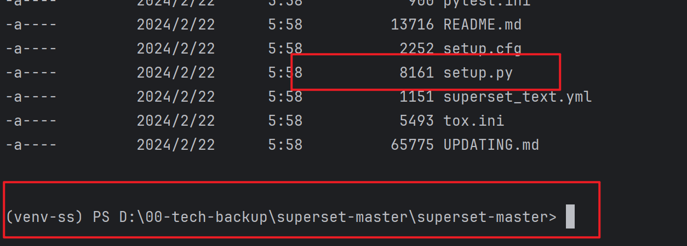
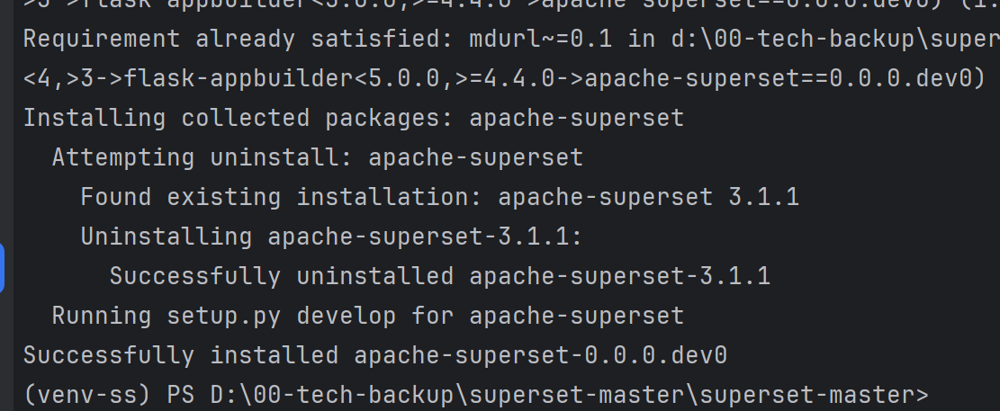
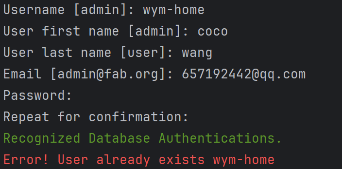
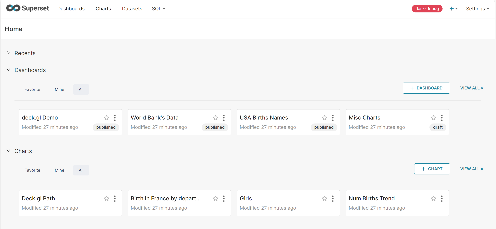

# 开发环境搭建
superset.apache.org/docs/instal…
安装 python 环境
安装最新版即可，最新版 python 自带 pip 打包管理工具，安装时需要将 python 添加到 path 中。
下载 superset 源码
github.com/apache/supe…  下载 master zip 即可。
部署 python 虚拟环境

命令最好使用 cmd，bash 创建用户时有问题。

js复制代码pip install virtualenv

js复制代码virtualenv env

js复制代码env\Scripts\activate

安装、初始化 superset
解压之前下载的 superset 源码，进入到源码目录。
设置 pip 国内源地址。
js复制代码pip config set global.index-url https://pypi.tuna.tsinghua.edu.cn/simple

安装 superset 本地测试依赖
js复制代码pip install -e .

安装 apache-superset
js复制代码pip install apache-superset

初始化数据库
js复制代码superset db upgrade

创建用户并初始化配置
js复制代码superset fab create-admin

superset load_examples // 下载 superset 案例，需要安全上网

superset init

启动 superset server
js复制代码superset run -p 3000 --with-threads --reload --debugger

这时访问地址，会发现没有资源。
前端项目配置
安装项目依赖
js复制代码cd superset-frontend

npm install

修改 webpack 配置
js复制代码{
  test: /\.jsx?$/,
  // include source code for plugins, but exclude node_modules and test files within them
  exclude: [/superset-ui.*\/node_modules\//, /\.test.jsx?$/],
  include: [
    new RegExp(`${APP_DIR}/src`),
    /superset-ui.*\/src/,
    new RegExp(`${APP_DIR}/.storybook`),
    path.resolve(__dirname, 'src'), // 添加本行代码，对 windows 环境不友好
  ],
  use: [babelLoader],
}

运行项目
js复制代码npm run dev

作者：heora
链接：https://juejin.cn/post/6991730150203195400
来源：稀土掘金
著作权归作者所有。商业转载请联系作者获得授权，非商业转载请注明出处。

## 创建管理用户及密码
$ export FLASK_APP=superset
flask fab create-admin
或者
fabmanager create-admin --app superset 

## 初始化数据库
superset db upgrade

#初始化角色和权限
superset init

#加载示例数据
superset load_examples
superset load_examples

#debug模式启动，并指定8088端口
superset run -p 8088 --with-threads --reload --debugger

前端的安装，cd incubator-superset\superset-frontend(superset前端模块)：

安装npm
执行 npm install，网络不好的可以使用镜像 registry=https://registry.npm.taobao.org
执行npm run dev启动前端

从本地启动superset后端， 官网使用的是python superset run -p 8088 --with-threads --reload --debugger,但我试了一下，这样会报can't find '__main__' module，看了下代码，这里不能从main启动，应该从flask-app来启动，因此直接执行flask run来本地启动superset后端

作者：coffeeBean
链接：https://juejin.cn/post/6844904097921892359
来源：稀土掘金
著作权归作者所有。商业转载请联系作者获得授权，非商业转载请注明出处。
## 本地开发环境部署
# Create a virtual environment and activate it (recommended)
python3 -m venv venv # setup a python3 virtualenv
source venv/bin/activate

# Install external dependencies
pip install -r requirements/testing.txt
# 重装apache-supers,注意当前目录是wheels文件的目录，但是虚拟环境都是同一个
pip install --force-reinstall --no-index --find-links=. .\apache-superset-3.1.1.tar.gz
# 注意开发环境不需要设置环境变量FLASK_APP
# Install Superset in editable (development) mode， 注意此时的目录需要切换到源码superset-master的根目录下，存在neither 'setup.py' nor 'pyproject.toml' found文件的目录

cd superset-master
pip install -e .

# Initialize the database
# Note: For generating a SECRET_KEY if you haven't done already, you can use the command:
# echo "SECRET_KEY='$(openssl rand -base64 42)'" | tee -a superset_config.py
superset db upgrade

# Create an admin user in your metadata database (use `admin` as username to be able to load the examples)
superset fab create-admin

如果存在就不用重新再创建，直接使用当前的用户密码登录就可以了。貌似是根据邮箱来识别唯一用户的。
# Create default roles and permissions
superset init

# Load some data to play with.
# Note: you MUST have previously created an admin user with the username `admin` for this command to work.
superset load-examples

cd superset-frontend
## 设置npm国内淘宝源
npm --registry=http://registry.npm.taobao.org install -d）
npm ci  
npm run dev 

# Start the Flask dev web server from inside your virtualenv.
# Note that your page may not have CSS at this point.
superset run -p 8088 --with-threads --reload --debugger --debug

## mkdocs
pip install mkdocs
mkdocs new 2024-docs
mkdocs serve
- 安装主题 https://github.com/squidfunk/mkdocs-material
- pip install mkdocs-material
- Add the following lines to mkdocs.yml:
  - theme:
    name: material
- demo usage: https://squidfunk.github.io/mkdocs-material/
  - demo how to do:https://squidfunk.github.io/mkdocs-material/creating-your-site/