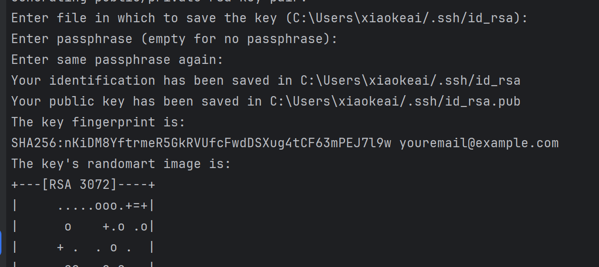

# 开发环境搭建
superset.apache.org/docs/instal…
安装 python 环境
安装最新版即可，最新版 python 自带 pip 打包管理工具，安装时需要将 python 添加到 path 中。
下载 superset 源码
github.com/apache/supe…  下载 master zip 即可。
部署 python 虚拟环境

命令最好使用 cmd，bash 创建用户时有问题。

js复制代码pip install virtualenv

js复制代码virtualenv env

js复制代码env\Scripts\activate

安装、初始化 superset
解压之前下载的 superset 源码，进入到源码目录。
设置 pip 国内源地址。
js复制代码pip config set global.index-url https://pypi.tuna.tsinghua.edu.cn/simple

安装 superset 本地测试依赖
js复制代码pip install -e .

安装 apache-superset
js复制代码pip install apache-superset

初始化数据库
js复制代码superset db upgrade

创建用户并初始化配置
js复制代码superset fab create-admin

superset load_examples // 下载 superset 案例，需要安全上网

superset init

启动 superset server
js复制代码superset run -p 3000 --with-threads --reload --debugger

这时访问地址，会发现没有资源。
前端项目配置
安装项目依赖
js复制代码cd superset-frontend

npm install

修改 webpack 配置
js复制代码{
  test: /\.jsx?$/,
  // include source code for plugins, but exclude node_modules and test files within them
  exclude: [/superset-ui.*\/node_modules\//, /\.test.jsx?$/],
  include: [
    new RegExp(`${APP_DIR}/src`),
    /superset-ui.*\/src/,
    new RegExp(`${APP_DIR}/.storybook`),
    path.resolve(__dirname, 'src'), // 添加本行代码，对 windows 环境不友好
  ],
  use: [babelLoader],
}

运行项目
js复制代码npm run dev

作者：heora
链接：https://juejin.cn/post/6991730150203195400
来源：稀土掘金
著作权归作者所有。商业转载请联系作者获得授权，非商业转载请注明出处。

## 创建管理用户及密码
$ export FLASK_APP=superset
flask fab create-admin
或者
fabmanager create-admin --app superset 

## 初始化数据库
superset db upgrade

#初始化角色和权限
superset init

#加载示例数据
superset load_examples
superset load_examples

#debug模式启动，并指定8088端口
superset run -p 8088 --with-threads --reload --debugger

前端的安装，cd incubator-superset\superset-frontend(superset前端模块)：

安装npm
执行 npm install，网络不好的可以使用镜像 registry=https://registry.npm.taobao.org
执行npm run dev启动前端

从本地启动superset后端， 官网使用的是python superset run -p 8088 --with-threads --reload --debugger,但我试了一下，这样会报can't find '__main__' module，看了下代码，这里不能从main启动，应该从flask-app来启动，因此直接执行flask run来本地启动superset后端

作者：coffeeBean
链接：https://juejin.cn/post/6844904097921892359
来源：稀土掘金
著作权归作者所有。商业转载请联系作者获得授权，非商业转载请注明出处。
## 本地开发环境部署
# Create a virtual environment and activate it (recommended)
python3 -m venv venv # setup a python3 virtualenv
source venv/bin/activate

# Install external dependencies
pip install -r requirements/testing.txt
# 重装apache-supers,注意当前目录是wheels文件的目录，但是虚拟环境都是同一个
pip install --force-reinstall --no-index --find-links=. .\apache-superset-3.1.1.tar.gz
# 注意开发环境不需要设置环境变量FLASK_APP
# Install Superset in editable (development) mode， 注意此时的目录需要切换到源码superset-master的根目录下，存在neither 'setup.py' nor 'pyproject.toml' found文件的目录

cd superset-master
pip install -e .

# Initialize the database
# Note: For generating a SECRET_KEY if you haven't done already, you can use the command:
# echo "SECRET_KEY='$(openssl rand -base64 42)'" | tee -a superset_config.py
superset db upgrade

# Create an admin user in your metadata database (use `admin` as username to be able to load the examples)
superset fab create-admin

如果存在就不用重新再创建，直接使用当前的用户密码登录就可以了。貌似是根据邮箱来识别唯一用户的。
# Create default roles and permissions
superset init

# Load some data to play with.
# Note: you MUST have previously created an admin user with the username `admin` for this command to work.
superset load-examples

cd superset-frontend
## 设置npm国内淘宝源
npm --registry=http://registry.npm.taobao.org install -d）
npm ci  
npm run dev 

# Start the Flask dev web server from inside your virtualenv.
# Note that your page may not have CSS at this point.
superset run -p 8088 --with-threads --reload --debugger

## mkdocs
pip install mkdocs
mkdocs new 2024-docs
mkdocs serve
- 安装主题 https://github.com/squidfunk/mkdocs-material
- pip install mkdocs-material
- Add the following lines to mkdocs.yml:
  - theme:
    name: material
- demo usage: https://squidfunk.github.io/mkdocs-material/
  - demo how to do:https://squidfunk.github.io/mkdocs-material/creating-your-site/
- npm 离线安装
- npm install -g npm-pack-all
npm ci
- npm build 
- npm run build
- 最终
终于可以跑起来了，你需要开两个终端一个跑前端，一个跑后端：

npm run dev
如果希望使用PyCharm进行开发，需要将$SUPERSET_HOME/superset/assets目录下面的node_modules目录标记为Exincluded(在node_modules目录上面右击Mark Directory as...)。其次需要配置PyCharm的Run/Debug Configurations中的Script和Script parameters:

Script: /path/to/user/incubator-superset/superset/bin/superset

----

- 1. 什么是 NPM
NPM 的全称是 Node Package Manager，是 Node.js 官方提供的包管理工具，他已经成了 Node.js 包的标准发布平台，用于 Node.js 包的发布、传播、依赖控制。

2. 如何使用 NPM
npm 不需要单独安装。在安装 Node 的时候，会连带一起安装 npm 。但 Node 附带的 npm 可能不是最新版本，最后用下面的命令，更新到最新版本。

$ sudo npm install npm@latest -g    # Linux 命令
npm install npm -g                  # Window 系统使用这个命令
 
也就是使用 npm 安装自己。之所以可以这样，是因为 npm 本身与 Node 的其他模块没有区别。
 
$ npm help              # 查看 npm 命令列表
$ npm -l                # 查看各个命令的简单用法
$ npm -v                # 查看 npm 的版本
$ npm config list -l    # 查看 npm 的配置
 
​常用命令
npm version  查看 npm 和 node 的版本
npm list --depth=0 [-g]  查看[全局]安装的包
npm root [-g]  查看[全局的]包的安装路径
3. npm init 初始化 package.json 文件
npm init 用来初始化生成一个新的 package.json 文件，安装包的信息可保持到项目中，它会向用户提问一系列问题，以便后续的其它的项目开发或者他人合作使用。如果你觉得不用修改默认配置，一路回车就可以了。如果使用了 -f（代表force）、-y（代表yes），则跳过提问阶段，直接生成一个新的 package.json 文件。

用法： npm init [-f|--force|-y|--yes]
$ npm init -y
4. package.json
package.json 是在运行 “ npm init ”时生成的，主要记录项目依赖，有以下结构

name：项目名，也就是在使用npm init 初始化时取的名字，但是如果使用的是npm init -y 快速初始化的话，那这里的名字就是默认存放这个文件的文件名；
version：版本号；
private：希不希望授权别人以任何形式使用私有包或未发布的；
scripts-serve：是vue的项目启动简写配置；
scripts-build：是vue的打包操作简写配置；
dependencies：指定了项目运行时所依赖的模块；
devDependencies：指定项目开发时所需要的模块，也就是在项目开发时才用得上，一旦项目打包上线了，就将移除这里的第三方模块；

5. package-lock.json
package-lock.json 是在运行 “npm install” 时生成的一个文件，只单纯记录本项目的依赖, 而没有记录下依赖的依赖, 并且依赖之间的版本号又没有明确固定, 导致无法保证依赖环境一致，进而导致项目出现bug。而package-lock.json就是用来lock住项目依赖的依赖以保证其他所有人人在使用 npm install 时下载的依赖包都是一致的。

6. package.json 和 package-lock.json总结
package.json用于告诉npm项目运行需要哪些包, 但包的最终安装的版本不能够只依靠这个文件进行识别, 还需以package-lock.json为准。package.json中修改版本号会影响package-lock.json, 并且package.json比package.lock.json的优先级高, 如果package.json中less版本为^1.0.0 , package-lock.json中less版本为2.1.2, 则最终安装的less版本为1.7.5, package-lock.json中less即其依赖的包将被从2.1.2退回到1.7.5`的状态。为了保证该项目的环境依赖一致, 在项目移动时需要同时复制 package.json 和 package.lock.json 两个文件。不要轻易动package.json与package-lock.json。
————————————————

                            版权声明：本文为博主原创文章，遵循 CC 4.0 BY-SA 版权协议，转载请附上原文出处链接和本声明。
                        
原文链接：https://blog.csdn.net/weixin_40521770/article/details/129545865

## pycharm中使用git push到github提示没有权限
> git@github.com: Permission denied (publickey).
fatal: Could not read from remote repository.
Please make sure you have the correct access rights
and the repository exists.

1. ssh-keygen -t rsa -C "youremail@example.com"
 
一路回车，不用输入秘钥
2. 去路径下打开.pub文件
3. https://blog.csdn.net/W_317/article/details/106518894
4. 19:27:43.794: [..\2024-docs] git -c credential.helper= -c core.quotepath=false -c log.showSignature=false push --progress --porcelain master refs/heads/master:refs/heads/master --set-upstream --follow-tags
error: failed to push some refs to 'github.com:duniang818/duniang818.github.io.git'
To github.com:duniang818/duniang818.github.io.git
hint: Updates were rejected because the remote contains work that you do not
!	refs/heads/master:refs/heads/master	[rejected] (fetch first)
hint: have locally. This is usually caused by another repository pushing to
hint: the same ref. If you want to integrate the remote changes, use
Done
hint: 'git pull' before pushing again.
hint: See the 'Note about fast-forwards' in 'git push --help' for details.
5. 清理缓存
git config --system --unset core.packedGitLimit
git config --system --unset core.packedGitWindowSize
git config --system --unset core.compression
git config --system --unset core.deltaBaseCacheLimit
